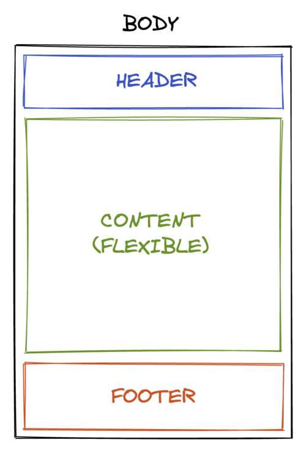

## Cas d'usage
Placer le footer en bas de l’écran lorsque le contenu du site n’est pas suffisant pour remplir tout le viewport, ou en dessous de la ligne de flottaison si le contenu du site est plus grand que le viewport.



## Recipe
Nous vous recommandons d’utiliser Flexbox, pour son côté moderne et flexible.
Nous partons avec les hypothèses suivantes :
* L’élément `html` a une `height` à `100%` (ou `100vh`).
* L’élément `body` a une `min-height` à `100%`, afin de prendre au moins toute la hauteur de l’écran.
* L’élément `body` est l’élément qui contient à la fois le `header`, le `footer`, et le contenu principal du site (regroupé sous un seul élément avec pour id `content`).

Pour répondre à notre objectif, il faudra :
* Ajouter les propriétés `display: flex` et `flex-direction: column` à l’élément `body`
* Permettre au contenu principal du site d’occuper tout l’espace restant disponible grâce à la propriété `flex-grow: 1` sur la div avec l’id `content`.

```html
<!DOCTYPE html>
<html lang="en">
<head>
   <meta charset="UTF-8">
   <title>Sticky footer</title>
   <style>
       html {
           height: 100%;
           width: 100%;
       }

       body {
           display: flex;
           flex-direction: column;
           min-height: 100%;
           margin: 0; 
       }
      
       header {
           height: 80px;
           background-color: powderblue;
       }

       footer {
           height: 120px;
           background-color: peachpuff;
       }
      
       #content {
           flex-grow: 1;
       }
   </style>
</head>
<body>
   <header>
       Logo de mon site, accès à mon compte utilisateur, éventuellement navigation...
   </header>
   <div id="content">
       Le contenu principal de mon site
   </div>
   <footer>
       Mentions légales, contact, conditions générales de vente, sitemap...
   </footer>
</body>
</html>
```

>Dans cet exemple, les header et footer ont une hauteur fixe, mais elles pourraient ne pas l’être. Ce code s’adapte très bien au contenu de ces éléments.

## Autres solutions
Il existe d'autres manières de placer le `footer` en bas de l’écran, avec parfois leurs contraintes :
* `display: grid` : si vous avez également des colonnes à agencer
* `position: absolute` ou `position: fixed` : à éviter sauf si votre footer doit rester en permanence en bas de viewport et donc éventuellement au-dessus du contenu du site. Prévoir un `padding-bottom` au moins égal à la hauteur du `footer` sur l'élément parent.
* `display: table` : seulement si vous êtes repartis dans les années 90 ou 2000 avec support de très vieux navigateurs ne supportant pas le flexbox.
