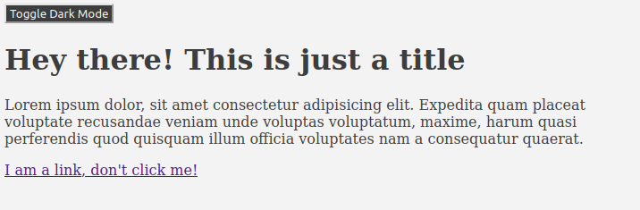
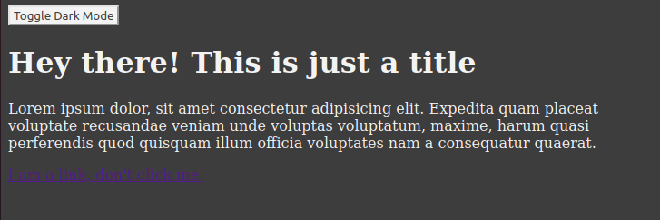

## Cas d'usage étudié
Le thème doit par défaut être celui utilisé par l'utlisateur et peut être modifié simplement.

## Solution proposée
Lister les différentes couleurs utilisées sur le site et les mettre dans des variables CSS (custom properties).

```css
:root {
    --white: #f3f3f3;
    --black: #3d3d3d;
    ...
}
```

**prefers-color-scheme**

Cette propriété CSS permet de détecter les préférences exprimées par l'utilisateur quant au thème à utiliser (dark ou light seulement).

Utiliser prefers-color-scheme pour de nouveau déclarer des variables CSS en utilisant les variables définies plus tôt.

```css
@media (prefers-color-scheme: light) {
    :root {
        --primary: var(--black);
        --secondary: var(--white);
    }
}

@media (prefers-color-scheme: dark) {
    :root {
        --primary: var(--white);
        --secondary: var(--black);
    }
}
```

Utiliser maintenant ces nouvelles variables directement dans votre CSS et le thème de l'utilisteur utilisé par défaut sera appliqué.

```css
body {
    background-color: var(--secondary);
    color: var(--primary);
}
```

Afin de laisser la possibilité à l'utilisateur de changer son thème on peut facilement mettre un bouton en place et appliquer un nouveau thème en ajoutant ou retirant une class au body.

```js
const btn = document.querySelector(".btn-toggle-theme");

btn.addEventListener("click", () => {
  if(document.body.classList.contains('dark-theme')) {
    document.body.classList.remove("dark-theme");
    document.body.classList.add("light-theme");
  } else {
    document.body.classList.remove("light-theme");
    document.body.classList.add("dark-theme");
  }
});
```
Puis on overwrite nos variables en CSS.
```css
.dark-theme {
    --primary: var(--white);
    --secondary: var(--black);
}

.light-theme {
    --primary: var(--black);
    --secondary: var(--white);
}

body {
    background-color: var(--secondary);
    color: var(--primary);
}

button {
    color: var(--secondary);
    background-color: var(--primary);
}
```

## Résultat



